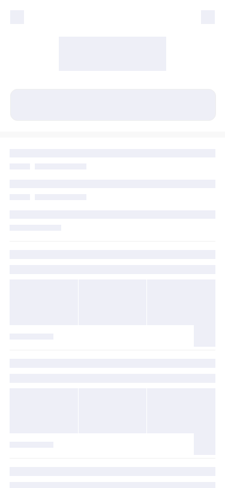

#### 根据 url 自动生成骨架屏
#### 百度首页生成效果
    生成节点不准确，遇到错误需多生成几次即可

#### 百度首页生成效果



#### 配置：

|url|目标链接|true|
|:----|:----|:----|
|output|输出目录<br>{<br>    filename // 生成文件名称<br>    fileDir // 生成文件地址<br>    injectSelector // 注入的节点<br>}|true|
|sleepTime|延迟生成|false|
|loadDestory|挂载卸载|false|
|device|生成的样式|['device', 'pc']|
|extraHTTPHeaders|请求时带的参数|false|
|savePicture|保存生成的骨架图片|false|
|pageShowContain|骨架屏展示的设备|['mobile', 'pc']|
|backgroundColor|骨架屏生成内容区域的背景色|false|

#### use:

```javascript
const skeleton = require('auto-skeleton@wang')
new Skeleton().init(
    skeletonConfig
)
```
#### 生成代码自动注入：

```javascript
const Skeleton = require('auto-skeleton@wang')
...
plugins: [
  new Skeleton({
      headTags: [],
      bodyTags: [{
          tagName: 'div',
          closeTag: true,
          attributes: {
              id: 'skeleton'
          },
          tagCode: ...
      }]
  })
]
...
```
参考：draw-page-structure
